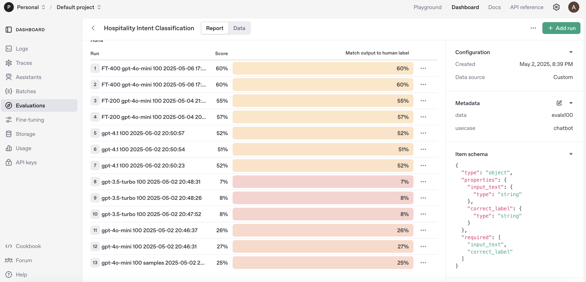

# GPT-4o-mini Fine-tuning for Hospitality Chatbot Intent Classification

This project demonstrates how to fine-tune GPT-4o-mini models for accuracy and latency optimization
 to achieve higher accuracy than with GPT-4.1 with much lower cost.
It uses real life scenario - intent classification for hospitality chatbots working with ambiguous guest queries.

## 🎯 Project Goal

The primary goal is to improve the accuracy and efficiency of hospitality chatbots in identifying the correct intent behind guest requests, even when those requests are ambiguously phrased. By fine-tuning smaller models like GPT-4o-mini, we can achieve performance comparable to larger models while reducing latency and costs.

## 🔍 Intent Classification Problem

Hospitality chatbots often struggle with correctly interpreting guest requests that are vague or ambiguous. For example, when a guest says "I'm concerned about my belongings after I officially conclude my stay," the chatbot needs to correctly identify this as a "Request late check-out" intent rather than confusing it with luggage storage or other services.

This project addresses this challenge by fine-tuning models to better recognize 40 different hospitality-related intents.

## 📋 List of 40 Hospitality-related Intents

GPT-4o-mini was fine-tuned to recognize the following 40 distinct intents that cover common guest interactions in hospitality settings:

1. **Check room availability** - Inquiries about whether rooms are available for specific dates
2. **Make a reservation / Book a room** - Requests to secure accommodations for future stays
3. **Modify reservation** - Changes to existing bookings (dates, room type, etc.)
4. **Cancel reservation** - Requests to cancel an existing booking
5. **Check reservation status** - Inquiries about the current status of a booking
6. **Request early check-in** - Asking to check in before the standard time
7. **Request late check-out** - Asking to check out after the standard time
8. **Check-in online** - Completing the check-in process electronically
9. **Check-out online** - Completing the check-out process electronically
10. **Request luggage assistance** - Help with handling or storing baggage
11. **Order room service** - Requesting food or beverages to be delivered to the room
12. **Book a table at a restaurant** - Reserving seating at an on-property dining venue
13. **Request menu or dietary information** - Inquiries about food options and accommodations
14. **Ask for breakfast hours or availability** - Information about morning meal service
15. **Request minibar refill** - Asking for in-room refreshment restocking
16. **Request room cleaning** - Asking for housekeeping services
17. **Request extra towels, toiletries, or pillows** - Additional room amenities
18. **Report an issue in the room** - Notifying staff about problems needing attention
19. **Request laundry service** - Garment cleaning or pressing services
20. **Request in-room amenities** - Additional items like irons, hair dryers, etc.
21. **Ask about local attractions or tours** - Information about nearby activities
22. **Request a wake-up call** - Asking for a scheduled reminder call
23. **Ask for taxi or shuttle service** - Transportation arrangements
24. **Ask about hotel policies** - Information about rules and procedures
25. **Request spa or gym appointment** - Booking wellness services
26. **Ask for invoice or receipt** - Documentation of charges
27. **Query charges on the bill** - Questions about specific billing items
28. **Change payment method** - Updating how charges will be paid
29. **Split bill** - Dividing charges among multiple payers
30. **Pre-authorize payment or deposit** - Setting up payment holds
31. **Ask for Wi-Fi access or help** - Internet connectivity assistance
32. **Ask about facility opening hours** - When venues or services are available
33. **Request parking information** - Vehicle storage options and procedures
34. **Ask about pet policy** - Rules regarding animals on property
35. **Ask about smoking policy** - Designated areas and rules for smoking
36. **Leave a review or feedback** - Sharing opinions about the stay
37. **Report a complaint** - Expressing dissatisfaction with services
38. **Ask to speak to a manager** - Requesting communication with leadership
39. **Request human support or live agent** - Asking for non-automated assistance
40. **Ask for help using the chatbot** - Assistance with the AI interface itself

These intents cover the full spectrum of guest needs during their hotel journey, from pre-arrival to post-departure.

## 🤗 VagueIntent: Hospitality Intent Classification Challenge

The datasets from this project are available on HuggingFace as part of the **[VagueIntent: Hospitality Intent Classification Challenge](https://huggingface.co/collections/atyurin/vagueintent-hospitality-intent-classification-challenge-681ba6c4ac8f09f308d1b7f8)** collection.

VagueIntent is a specialized collection designed to improve intent classification for hospitality chatbots working with ambiguous guest queries. This collection was created to help the GenAI community tackle the challenging problem of understanding guest intentions when they communicate indirectly.

The collection contains two companion datasets:

1. **[VagueIntent-Train](https://huggingface.co/datasets/atyurin/VagueIntent-Train)** (400 samples): AI-generated vague user prompts paired with correct intent mappings for fine-tuning language models like GPT-4o-mini. Each sample represents one of 40 distinct hospitality intents that are deliberately challenging to classify due to indirect language, euphemisms, and lack of explicit keywords. This dataset uses the `tests400.jsonl` file from this repository.

2. **[VagueIntent-Eval](https://huggingface.co/datasets/atyurin/VagueIntent-Eval)** (100 samples): A separate evaluation dataset, designed specifically for benchmarking the performance improvements after fine-tuning. This dataset uses the `evals100.jsonl` file from this repository.

Both datasets include challenging real-world hospitality scenarios where guests communicate their needs indirectly - from requesting late check-outs to inquiring about dietary options - without using obvious intent-signaling language. Each vague message is paired with its correct intent mapping among 40 predefined hospitality-specific intents.

This collection addresses a critical gap in hospitality AI: understanding what guests want when they don't clearly state it. Ideal for researchers and developers working to improve chatbot performance in the hospitality industry.

## 💼 Benefits of this project

- **Complete Fine-tuning Workflow**: Working code for synthetic data generation, fine-tuning, evaluation
- **Automated Data Generation**: Scripts to generate synthetic training data for supervised fine-tuning (SFT)
- **Fine-tuning Optimization**: Techniques to balance accuracy and latency
- **Large-to-Small Model Distillation**: Leverage knowledge from larger models to improve smaller ones
- **OpenAI Fine-tuning API Integration**: Structured fine-tuning framework to improve models
- **OpenAI Evals API Integration**: Structured evaluation framework to measure model performance
- **Real-world Use Case**: Addresses an actual problem faced by production chatbots

## 📈 Accuracy Improvement Results

Our experiments show significant accuracy improvements through fine-tuning:



### Performance Comparison Table

| Model | Accuracy on Intent Classification |
|-------|----------------------------------|
| GPT-3.5-turbo | 8% |
| GPT-4o-mini (before fine-tuning) | 26% |
| GPT-4.1 | 52% |
| GPT-4o-mini + SFT (200 samples) | 56% |
| GPT-4o-mini + SFT (400 samples) | 60% |

As shown above, fine-tuning GPT-4o-mini with just 400 examples provides a 130% improvement over the base model and even outperforms GPT-4.1, while maintaining significantly lower cost and latency.

## 📊 Fine-tuning Benefits vs Prompting

| Aspect | Fine-tuning Advantage                                     |
|--------|-----------------------------------------------------------|
| Latency | Faster responses                                          |
| Cost | Reduced token usage and model size                        |
| Stability | More consistent results across various phrasings          |
| Accuracy | Better performance on domain-specific tasks               |
| Efficiency | Achieve same accuracy with a smaller model                |
| Scale | Can train on thousands of examples (beyond prompt limits) |
| Token Economy | Shorter prompts reduce token consumption                  |

## 🛠️ Project Structure

```
├── README.md                     # Project documentation
├── create_jsonl.py               # Script to create file with test data (e.g. tests200_2.jsonl) out of mapping file to be used for SFT
├── evals100.jsonl                # 100 ambiguous messages and their correct intents to be used with OpenAI Evals API
├── generate_4.1_lists_20.py      # Script to generate vague messages using GPT-4.1 and test them with gpt-4o-mini locally
├── messages_mappings100.py       # 100 ambiguous messages and their correct intents
├── messages_mappings200.py       # 200 ambiguous messages and their correct intents
├── messages_mappings200_2.py     # Additional 200 ambiguous messages for testing
├── openai_eval.py                # Script to run evaluations through OpenAI API
├── openai_ft.py                  # Script to perform supervised fine-tuning (SFT)
├── requirements.txt              # Requirements for this project
├── test_intent_4o-mini_200.py    # Script to generate responses with gpt-4o-mini and compare them with correct ones locally
├── tests200.jsonl                # 200 ambiguous messages and their correct intents to be used with OpenAI fine-tuning API
├── tests200_2.jsonl              # Another 200 ambiguous messages and their correct intents to be used with OpenAI fine-tuning API
├── tests400.jsonl                # 400 ambiguous messages and their correct intents to be used with OpenAI fine-tuning API
```

## 🚀 Getting Started

### Prerequisites

- Python 3.8+
- OpenAI API key with access to fine-tuning capabilities
- pip packages: openai

### Setup

1. Clone this repository
```bash
git clone https://github.com/alexey-tyurin/fine-tuning-gpt.git
cd gpt4o-mini-finetuning
```

2. Set up your OpenAI API key as an environment variable
```bash
export OPENAI_API_KEY="your-api-key-here"
```

3. Install required dependencies
```bash
pip install -r requirements.txt
```

### Supervised Fine-tuning (SFT)

1. Run the fine-tuning script
```bash
python openai_ft.py --all
```

Or run steps individually:
```bash
python openai_ft.py --upload      # Upload training data
python openai_ft.py --create      # Create fine-tuning job
python openai_ft.py --status      # Check status
python openai_ft.py --analyze     # Analyze results
```

### Evaluation

Run the evaluation to test model performance:
```bash
python openai_eval.py --all
```


## 📝 Results

Our experiments show that fine-tuned GPT-4o-mini models can achieve:
- 130% accuracy improvement on intent classification tasks
- Reduced token consumption and associated costs
- More consistent responses across various query phrasings

## 🔄 Workflow

1. **Data Preparation**: Create training data with ambiguous messages and correct intent mappings
2. **Initial Fine-tuning**: Perform supervised fine-tuning using the OpenAI API
3. **Evaluation**: Test the model against a held-out test set
4. **Deployment**: Integrate the fine-tuned model into your chatbot


## 🙏 Acknowledgements

- OpenAI for providing fine-tuning and evaluation capabilities

## Contact Information

For any questions or feedback, please contact Alexey Tyurin at altyurin3@gmail.com.

## License


